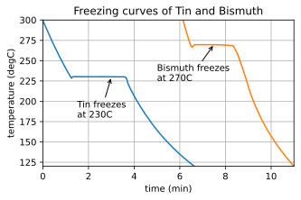
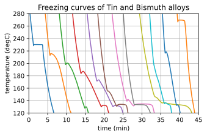
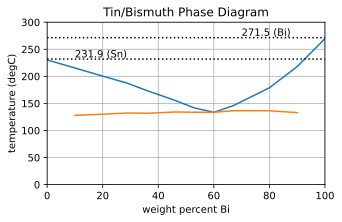

# Tin Bismuth Eutectic Allow Science Fair project

## General comments

This code was written as part of a science fair project with one of my sons when he was in middle school. Science fairs typically make a big deal out of following the "scientific method", but this is not how real scientists work. This project shows how suprising results can lead to new insights.

First, we measured the freezing points of two metals, tin and bismuth. The freezing point data is fairly obvious as the flat areas in the graph below which shows measured temputature versus time. A reasonable hypothesis is that the freezing point of a mixture of tin and bismuth will be somewhere between the freezing point of tin and the freezing point of bismuth.

To get this data, we used an Ardiuno with a K-type thermocouple, an AD8495 amplifer, and an ADS1115 ADC. The code is in directory ./arduino. A C# GUI to plot the data in real-time while logging it is in directory ./GUI

We then made several mixtures of tin and bismuth with varying amounts of the two metals. The freezing diagrams are shown below. For many of the alloys, there is not a clear plateau in the temperature graph as the metal cools off, but there is a clear change in the cooling rate. I wish we had cooled the metals off more slowly by insulating them during the cooldown to avoid the supercooled bounce-back.

Collecting the data from at which temperatures each allow started and ended its freezing (liquidus and solidus), and plotting it as a function of the fraction of bismuth in each alloy gives the phase diagram as shown below. 

The eutectic freezing point for the alloy of 40/60% Sn/Bi at a temperature far below the freezing points of either tin or bismuth is quite striking.

## Links

- [Orfanidis Book and Matlab Code](http://www.ece.rutgers.edu/~orfanidi/ewa)
- [Materials Database](https://refractiveindex.info/)
- [Sopra Database](http://www.sspectra.com/sopra.html)
